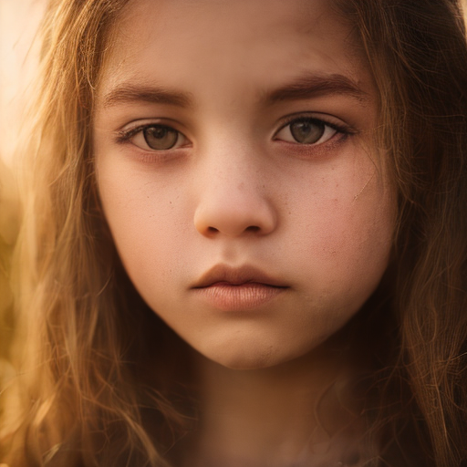

# News

**Use the new version for community: [SDXS-512-DreamShaper](https://huggingface.co/IDKiro/sdxs-512-dreamshaper). It has better quality and is faster.**

# SDXS-512-0.9

SDXS is a model that can generate high-resolution images in real-time based on prompt texts, trained using score distillation and feature matching. For more information, please refer to our research paper: [SDXS: Real-Time One-Step Latent Diffusion Models with Image Conditions](https://arxiv.org/abs/2403.16627). We open-source the model as part of the research.

SDXS-512-0.9 is a **old version** of SDXS-512. In order to avoid some possible commercial and copyright risks, the SDXS-512-1.0 and SDXS-1024-1.0 will not be available shortly, and as an alternative we will provide new versions with different teacher DM or offline DM. Watch [our repo](https://github.com/IDKiro/sdxs) for any updates.

Model Information:
- Teacher DM: [SD Turbo](https://huggingface.co/stabilityai/sd-turbo)
- Offline DM: [SD v2.1 base](https://huggingface.co/stabilityai/stable-diffusion-2-1-base)
- VAE: [TAESD](https://huggingface.co/madebyollin/taesd)

The main differences between this model and version 1.0 are in three aspects:
1. This version employs TAESD, which may produce low-quality images when weight_type is float16. Our image decoder is not compatible with the current version of diffusers, so it will not be provided now.
2. This version did not perform the LoRA-GAN finetune mentioned in the implementation details section, which may result in slightly inferior image details.
3. This version replaces self-attention with cross-attention in the highest resolution stages, which introduces minimal overhead compared to directly removing them.

## Diffusers Usage



```python
import torch
from diffusers import StableDiffusionPipeline, AutoencoderKL

repo = "IDKiro/sdxs-512-0.9"
seed = 42
weight_type = torch.float32     # or float16

# Load model.
pipe = StableDiffusionPipeline.from_pretrained(repo, torch_dtype=weight_type)

# use original VAE
# pipe.vae = AutoencoderKL.from_pretrained("IDKiro/sdxs-512-0.9/vae_large")
 
pipe.to("cuda")

prompt = "portrait photo of a girl, photograph, highly detailed face, depth of field, moody light, golden hour"

# Ensure using 1 inference step and CFG set to 0.
image = pipe(
    prompt, 
    num_inference_steps=1, 
    guidance_scale=0,
    generator=torch.Generator(device="cuda").manual_seed(seed)
).images[0]

image.save("output.png")
```

## Cite Our Work

```
@article{song2024sdxs,
  author    = {Yuda Song, Zehao Sun, Xuanwu Yin},
  title     = {SDXS: Real-Time One-Step Latent Diffusion Models with Image Conditions},
  journal   = {arxiv},
  year      = {2024},
}
```
